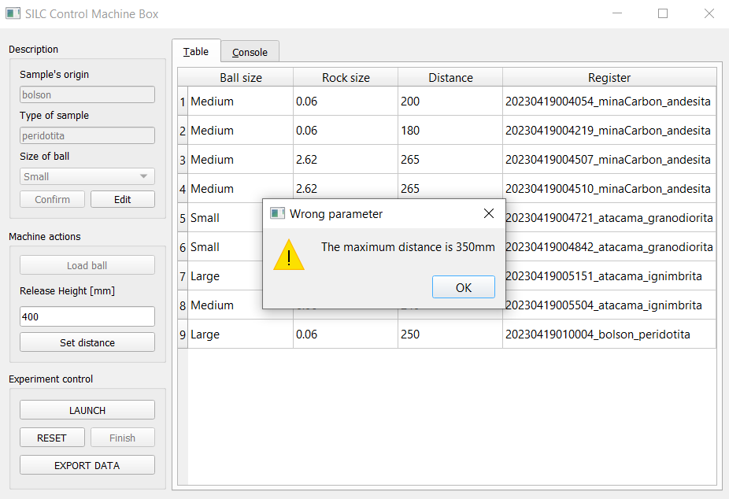

# SILC Control Machine Box

Repository of the work done during my professional practice for SILC Machine, developed at the Digital Manufacturing Laboratory (FabLab) of the University of Chile

## Graphical User Interface

## Credits

<h3 align="center">
  Fabrication Laboratory   Faculty of Physical and Mathematical Sciences   University of Chile
</h3>
